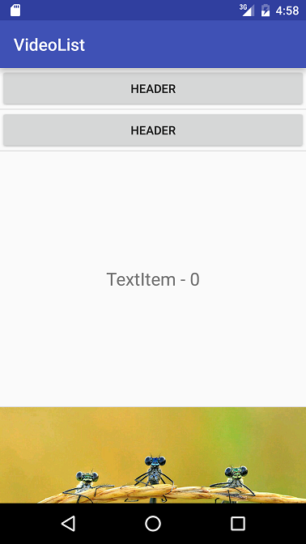

 

# VideoListPlayer
VideoListPlayer实现了在列表控件（ListView, RecyclerView）中加载并播放视频，并支持滑动时自动播放/暂停的功能

利用该项目，可以轻松实现类似Instagram的视频播放功能

**注意：最低支持API 14以上**

#效果预览
 

#Changelogs

**v.14**

1. 支持更多类型的scaleType，详见 [Android-ScalableVideoView](https://github.com/yqritc/Android-ScalableVideoView)
2. 加入 `getCurrentPosition()` 和 `getDuration()` 接口

**v1.3**

1. fix在多类型列表元素中出现视频无法正常播放的bug

**Demo 更新**
	
1. 增加在ListView中播放视频的示例
2. ListView和RecyclerView中支持多类型view type展示

**v1.2**
	
1. fix NPE bugs

**v1.1**

1. 自动播放/停止功能性能优化

2. 视频播放加入声音开关控制，默认播放视频关闭声音，点击视频开启声音

3. fix在4.1.1以下无法播放视频的bug

#基本用法
添加gradle依赖
	
	repositories {
		maven { url "https://jitpack.io" }
	}
	
	dependencies {
	        compile 'com.github.waynell:VideoListPlayer:1.4'
	}

在xml布局中加入以下代码

	<com.waynell.videolist.widget.TextureVideoView
            android:id="@+id/video_view"
            android:layout_width="match_parent"
            android:layout_height="300dp" />
            
然后设置视频路径地址，最后调用start()方法开始播放视频

	videoView.setVideoPath(mVideoPath);
    videoView.start();

视频播放是异步的，可以通过设置MediaPlayerCallback回调监听播放事件

	view.setMediaPlayerCallback(this);

监听事件如下

    void onPrepared(MediaPlayer mp);
    void onCompletion(MediaPlayer mp);
    void onBufferingUpdate(MediaPlayer mp, int percent);
    void onVideoSizeChanged(MediaPlayer mp, int width, int height);

    boolean onInfo(MediaPlayer mp, int what, int extra);
    boolean onError(MediaPlayer mp, int what, int extra);

#滑动时自动播放/停止的功能
首先，你必须实现ListItem接口来获取item被激活或取消激活的事件回调
	
    public interface ListItem {
        
        // 当前item被激活
        void setActive(View newActiveView, int newActiveViewPosition);
        
        // 当前item被取消
        void deactivate(View currentView, int position);
	}

其次，实现ItemsProvider接口返回当前列表总数和列表中某一位置的ListItem实例
	
    public interface ItemsProvider {

    	ListItem getListItem(int position);

    	int listItemSize();
	}

最后添加以下代码实现可见比的计算，以RecyclerView为例
	
    ItemsProvider itemProvider;

	ListItemsVisibilityCalculator calculator = new SingleListViewItemActiveCalculator(itemProvider,
    	new RecyclerViewItemPositionGetter(layoutManager, mRecyclerView););
    
    mRecyclerView.addOnScrollListener(new RecyclerView.OnScrollListener() {
            @Override
            public void onScrollStateChanged(RecyclerView recyclerView, int newState) {
                mScrollState = newState;
                if(newState == RecyclerView.SCROLL_STATE_IDLE && !mListItems.isEmpty()){
                    mCalculator.onScrollStateIdle();
                }
            }

            @Override
            public void onScrolled(RecyclerView recyclerView, int dx, int dy) {
                mCalculator.onScrolled(mScrollState);
            }
        });
        
# 网络视频的本地缓存
请参考demo工程的实现

#实现原理
请参见我的博客 [视频在滑动列表中的异步缓存和播放](http://blog.waynell.com/2016/03/21/video-loader/)

#Thanks
[VideoPlayerManager](https://github.com/danylovolokh/VideoPlayerManager)
滑动自动播放/暂停的功能基于项目优化而来
